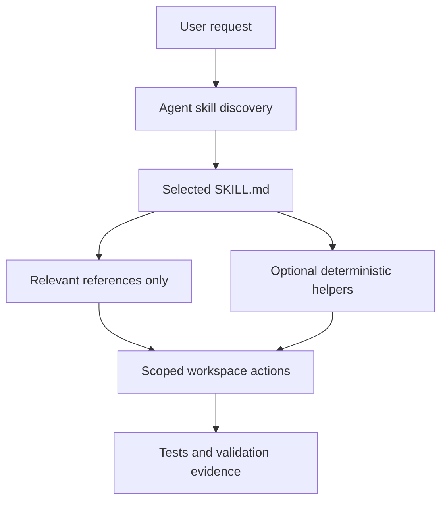

# Skills Repository Architecture

## Purpose

This repository publishes independent Agent Skills that can be discovered and installed by compatible coding agents. Each top-level skill directory is a distributable capability; the repository root provides shared discovery and contribution guidance rather than a shared runtime framework.

## Package Boundary

A skill package uses the smallest subset of this structure that its workflow needs:

```text
<skill-name>/
├── SKILL.md              # Required discovery metadata and agent instructions
├── agents/openai.yaml    # Optional Codex UI metadata and invocation policy
├── references/           # Conditional, progressively disclosed guidance
├── scripts/              # Deterministic helpers when repeated automation is useful
├── assets/               # Files copied or adapted into user deliverables
└── tests/                # Skill-specific executable contract tests when warranted
```

`SKILL.md` is the only required entrypoint. It owns routing and essential invariants, links directly to relevant references, and does not require an application runtime. References do not import or mutate other skill packages.

## Current Modules

Detailed documents for larger independent modules are indexed in [architecture/modules.md](architecture/modules.md).

| Module | Responsibility | Dependencies |
|---|---|---|
| `vibe-coding` | Risk-adjusted coding lifecycle: planning, approval, TDD, documentation sync, review, and QA | Self-contained references |
| `project-setup` | Safe, stack-aware initialization and cold-start verification of new production-oriented projects | Self-contained references |
| `code-duplication-scanner` | Detect duplication between Git changes and an existing codebase | Local Python helper and refactoring reference |
| `d2` | D2 diagram authoring guidance and examples | Self-contained D2 references/assets |
| `github-arch-analyzer` | Repository architecture analysis and Chinese Markdown reporting | Optionally uses a diagram skill when available |

Each package defines its own runtime boundary. Repository co-location does not create a dependency: a skill must not load or invoke a neighboring workflow unless that composition is itself the requested capability.

## Dependency Direction



- Discovery metadata points inward to the selected package.
- `SKILL.md` may route to its own references, scripts, and assets.
- Helpers implement mechanics but do not redefine user intent or authorization.
- Validation consumes the produced package or workspace state; production instructions must not depend on tests.
- Repository-level documents may index packages, but packages must not require root documentation at installation time.

## Project Setup Flow

`project-setup` resolves a safe target and project profile, creates the minimum baseline, proves it through public-path and clean-environment verification, reports evidence, and stops. It neither embeds a universal application template nor transfers control to a general development workflow.

```mermaid
flowchart LR
    A["Initialization request"] --> B["Target and profile preflight"]
    B --> C["Minimal initialization blueprint"]
    C --> D["Official scaffold or minimal manual baseline"]
    D --> E["Runnable vertical slice"]
    E --> F["Docs, tests, quality gates, security and observability"]
    F --> G["Clean-environment verification"]
    G --> H["Evidence report and stop"]
```



## Development and Validation

- Root `README.md` is the public skill index.
- `CLAUDE.md` contains stable repository workflow and skill inventory guidance.
- Medium and complex changes persist task Specs and Plans under `docs/`.
- Architecture-affecting decisions live under `docs/decisions/`.
- Skill-specific tests remain inside the skill package when they validate distributable invariants.
- New or updated skills run the skill-creator validator; scripts must also be exercised through their real entrypoint.
- Documentation is synchronized from the final diff before independent review.

## Change Rules

- Keep each skill independently understandable and installable.
- Prefer progressive disclosure over a large entrypoint.
- Do not add a cross-skill runtime dependency unless composition is the package's explicit user-facing capability.
- Update this document when package boundaries, dependency direction, shared validation, or runtime composition rules change.
