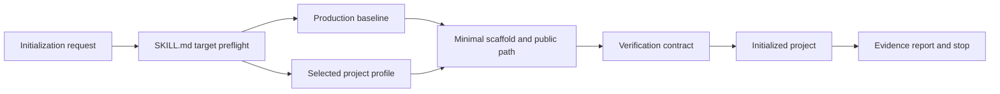

# Project Setup Module

## Goal

`project-setup` is an independently installable Agent Skill that converts a new or explicitly agreed bootstrap-only directory into a minimal, production-oriented project, verifies the cold-start result, reports evidence, and stops.

## Responsibilities

- Resolve and classify the exact target before mutation.
- Preserve existing content and prevent silent force/clean/overwrite behavior.
- Resolve initialization-specific choices such as project profile, runtime, package manager, public entrypoint, distribution/deployment shape, and real external boundaries.
- Use an official/ecosystem generator when appropriate or create the smallest manual scaffold.
- Establish a runnable public path plus architecture, Docs as Code, configuration, error, observability, security, test, build, and reproducibility baselines appropriate to the selected project.
- Verify applicable quality gates, public success/failure paths, and a candidate-only clean-environment bootstrap.
- Report evidence and end the initialization task.

## Boundaries and Non-responsibilities

- The module does not continue into product feature development beyond the minimal behavior required to prove the scaffold.
- It does not provide a general planning, approval, branching, feature-delivery, or independent-review lifecycle.
- It does not discover, load, invoke, require, or provide a fallback for another workflow skill.
- It does not silently create remote repositories, hosted CI bindings, cloud resources, external accounts, production data, paid services, or global tool installations.
- It does not ship a framework-specific universal application template.

## Public Interface

| Interface | Role |
|---|---|
| `project-setup/SKILL.md` | Discovery metadata, target preflight, initialization router, safety boundary, verification, and stop condition |
| `project-setup/agents/openai.yaml` | Optional Codex UI presentation and default `$project-setup` invocation |
| `references/production-baseline.md` | Common production baseline loaded before designing the target |
| `references/project-profiles.md` | Only the section matching the selected project type |
| `references/verification.md` | Applicable test, quality, public-path, clean-environment, and evidence rules |

Inputs are the user request, exact target state, applicable parent-repository instructions, and current primary documentation needed for unstable tool/version decisions. Outputs are scoped project files plus a concise evidence report. No package-specific service or runtime is required.

## Dependency and Data Flow

Dependencies stay inside the package: the entrypoint routes to its references, while generated project code never depends on skill tests or repository-root documentation. External generators and package managers are selected from the user's technology choice and remain subject to authorization and current official guidance.

## Validation

- Package contracts verify discovery metadata, required files, local links, placeholder removal, and absence of workflow-skill coupling.
- Repository contracts copy the distributable skill into an isolated directory, run its package tests there, verify root inventory text, and require this module document/index.
- The skill-creator validator checks package structure and frontmatter.
- Independent forward tests exercise target protection, project generation, lock semantics, public paths, aggregate QA, clean-environment reproducibility, authorization boundaries, and the explicit stop condition.
