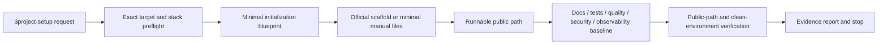

# Project Setup Skill Implementation Plan

## Status

- [x] Inspect repository guidance, existing skills, validation tools, and user-owned changes.
- [x] Obtain approval for the initial medium-complexity Spec and Plan.
- [x] Create `codex/project-setup-skill` in an isolated development worktree.
- [x] Build the first skill version and use review/forward-test evidence to identify defects.
- [x] Re-scope after user feedback so the distributable skill owns initialization only and has no runtime workflow-skill dependency.
- [x] Add a decoupling regression contract, confirm RED, rewrite the skill, and restore GREEN.
- [x] Synchronize repository architecture, ADR, Spec, Plan, and inventory with the independent scope.
- [x] Complete independent forward acceptance against the final skill; bootstrap-only and clean-room behavior passed, and final review accepted absent-target non-coverage as a non-blocking risk.
- [x] Run independent final review and repair validated findings.
- [x] Rebase onto the latest `origin/master`, rerun complete QA, and create the local task commit.

## Design



The distributable skill has no edge to another workflow skill. This task may use repository development practices to build and review the skill, but those practices are not copied into the skill's runtime instructions.

## Implementation Steps

1. Maintain package and repository contract tests for:
   - required files and valid discovery metadata;
   - local Markdown link resolution;
   - UI metadata and `$project-setup` invocation;
   - absence of initializer placeholders;
   - absence of runtime workflow-skill, worktree, approval-gate, or Subagent dependencies;
   - repository inventory entries;
   - package self-containment after isolated copying.
2. Keep `SKILL.md` as a concise initialization router:
   - target classification and overwrite protection;
   - material initialization decisions only;
   - minimal scaffold creation;
   - contextual reference routing;
   - initialization verification and stop boundary.
3. Keep supporting references independent and progressively disclosed:
   - `production-baseline.md` for architecture, Docs as Code, config, dependency/lock semantics, errors, observability, failure modes, security, local automation, and complexity controls;
   - `project-profiles.md` for service/API, Web/UI, CLI, library/package, worker/consumer, and justified monorepo differences;
   - `verification.md` for custom-behavior TDD, applicable test layers, quality commands, public-path checks, clean-environment bootstrap, evidence, and final self-checks.
4. Update `README.md`, `CLAUDE.md`, repository architecture, and ADR so inventory and dependency direction match the independent implementation.
5. Run package/repository tests, the bundled skill validator, Markdown/diff checks, secret scan, and protected-directory comparison.
6. Give an independent evaluator the final skill and a realistic already-approved request in a fresh disposable directory. Verify artifacts, lock semantics, public paths, aggregate QA, clean-environment bootstrap, and authorization boundaries.
7. Give an independent reviewer the final Spec, acceptance criteria, architecture/docs impact, complete diff, tests, and forward evidence. Fix valid findings and repeat checks.
8. Rebase the local task branch onto the latest `origin/master`, rerun all QA, and create a local commit without pushing or installing the skill.

## Files

- `project-setup/SKILL.md`
- `project-setup/agents/openai.yaml`
- `project-setup/references/production-baseline.md`
- `project-setup/references/project-profiles.md`
- `project-setup/references/verification.md`
- `project-setup/tests/test_skill_contract.py`
- `tests/test_project_setup_repository.py`
- `README.md`
- `CLAUDE.md`
- `docs/architecture.md`
- `docs/architecture/modules.md`
- `docs/architecture/modules/project-setup.md`
- `docs/decisions/0001-project-setup-independent-scope.md`
- `docs/specs/2026-08-28-project-setup-skill.md`
- `docs/plans/2026-08-28-project-setup-skill.md`

## Test Strategy

```text
python3 -m unittest discover -s project-setup/tests -p 'test_*.py' -v
python3 -m unittest discover -s tests -p 'test_*.py' -v
uv run --with pyyaml python <skill-creator>/scripts/quick_validate.py project-setup
git diff --check
```

Also verify all task-authored paths, local links, absence of secret-shaped content, no unfinished scaffolding, package behavior after isolated copying, and no task-authored diff under `vibe-coding/`.

## TDD and Review Evidence

- `[PASS]` Initial package contract RED failed because the skill and index did not yet exist; the first implementation restored GREEN.
- `[PASS]` Distribution regression RED reproduced a package test that incorrectly depended on the repository root README; the check moved to the repository suite and isolated package tests restored GREEN.
- `[PASS]` Decoupling regression RED found `$vibe-coding`, worktree, Approval Gate, and independent-Agent dependencies in the distributable instructions; the independent initialization rewrite restored 6/6 package tests to GREEN.
- `[SUPERSEDED]` The first forward scenario proved most initialization mechanics but exercised the coupled version and generated a comment-only empty lock; it is not acceptance evidence for the final skill.

## Architecture & Documentation Impact Analysis

`Docs Impact: Updated`

- A new independently installable `project-setup` package changes the repository module inventory and validation surface.
- The final package has no dependency edge to `vibe-coding` or another workflow skill.
- Root discovery, stable repository inventory, architecture, ADR, this Spec, and this Plan must describe the independent initialization boundary.
- Latest repository rules classify `project-setup` as a larger independent module, so `docs/architecture/modules.md` and `docs/architecture/modules/project-setup.md` document its entrypoint, responsibilities, dependencies, and core flow.
- Skill-specific tests stay inside the package; repository-only inventory and distribution-isolation checks stay under root `tests/`.

## Final Verification Evidence

- `[PASS]` Package contract: `python3 -m unittest discover -s project-setup/tests -p 'test_*.py' -v` — 6/6 passed, including the no-runtime-workflow-dependency regression.
- `[PASS]` Repository contract: `python3 -m unittest discover -s tests -p 'test_*.py' -v` — 3/3 passed, including isolated distribution-copy execution, uncoupled inventory text, and required independent-module architecture documentation.
- `[PASS]` Skill validator: bundled `quick_validate.py project-setup` — `Skill is valid!`.
- `[PASS]` Forward functionality: Python 3.9+ standard-library CLI; Unit 4/4, E2E 2/2, Integration/Regression explicitly `[N/A]`, aggregate format/lint/static/security/build/test QA passed, success/error source and zipapp paths passed, and repeated builds were byte-identical.
- `[PASS]` Forward independence and lock semantics: no other workflow skill concepts, no global/third-party install, no network/remote/cloud action, no lock file for an ecosystem with no resolver or lockable graph, and no comment/placeholder lock.
- `[PASS]` Forward clean environment: candidate-only copy in a no-pip Python 3.9.6 environment reran complete QA and source/artifact paths successfully.
- `[PASS]` Target preflight: the assigned target contained tests/docs seed files from an interrupted evaluator. The final evaluator correctly classified and preserved them as request-matching bootstrap-only content; final review accepted this as a valid supported forward scenario. Physical absent-target behavior remains a non-blocking untested risk.
- `[PASS]` Observability applicability: final review accepted `[N/A]` for structured logging and `trace_id` in a deterministic single-process CLI with no external call, persisted state, retry, or multi-step operation. The baseline now requires correlation only when execution actually needs association across steps, modules, or external boundaries and requires an explicit architecture/QA rationale for `[N/A]`.
- `[PASS]` Documentation regression RED: root tests failed when the latest required module index/document were absent; adding `docs/architecture/modules.md` and `docs/architecture/modules/project-setup.md` restored the repository contract.
- `[PASS]` Independent final Review: Spec Verifier + Cleaner and Documentation Gate reported no unresolved blocking finding after all corrections.
- `[PASS]` Post-rebase QA: package contract 6/6, repository contract 3/3, official skill validator, and `git diff --check` all passed on top of the latest `origin/master`.
- `[PASS]` Boundary scans: no runtime workflow coupling or secret-shaped content was found, and the task diff contains no path under `vibe-coding/`.
- `[PASS]` Local delivery: `codex/project-setup-skill` is one commit ahead of `origin/master`; nothing was pushed or installed into a personal skill directory.
