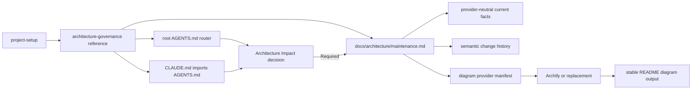

# Project Setup Architecture Governance Implementation Plan

## Status

- [x] Inspect the existing skill, tests, repository instructions, architecture documents, and current Archify/Codex/Claude Code primary documentation.
- [x] Agree on a provider-neutral architecture-governance design and progressive-disclosure boundary.
- [x] Obtain user approval for implementation.
- [x] Create `codex/project-setup-architecture-governance` from the locally available `origin/master` in an isolated worktree. A remote refresh was attempted but GitHub TLS connectivity failed.
- [x] Add contract tests and confirm the intended missing behavior fails.
- [x] Add the architecture-governance reference and generated-policy asset.
- [x] Update the `project-setup` entrypoint and verification guidance.
- [x] Synchronize repository architecture, ADR, Spec, Plan, and inventory descriptions.
- [x] Run the complete automated suite and skill validator.
- [x] Complete independent review, repair valid findings, and finish risk-adapted QA.

## Design



The always-loaded Agent context contains only the semantic trigger, the reference link, and the completion invariant. The detailed workflow is a repository-local generated policy, so later Codex and Claude Code tasks can load it without invoking `project-setup`. Architecture facts and history remain independent of the selected diagram renderer.

## Implementation Steps

1. Extend `project-setup/tests/test_skill_contract.py` with contract tests for:
   - required architecture reference and policy asset;
   - entrypoint routing and local-link resolution;
   - generated `AGENTS.md` and `CLAUDE.md` behavior;
   - semantic impact criteria and on-demand policy loading;
   - provider isolation, fallback, validation failure, history, and README contracts;
   - absence of silent provider installation or hard Archify dependency.
2. Run the package suite and retain the expected RED evidence.
3. Add `project-setup/references/architecture-governance.md` with:
   - preflight and preservation rules;
   - idempotent managed blocks;
   - cross-Agent routing;
   - provider manifest requirements and default-provider selection;
   - initialization outputs and acceptance checks.
4. Add `project-setup/assets/architecture-maintenance.md` as the ready-to-adapt repository policy covering later architecture-impact decisions and synchronization behavior.
5. Update `project-setup/SKILL.md` to route to the new reference during blueprint/documentation creation, and update verification guidance without duplicating the full policy.
6. Update `project-setup/references/verification.md` only where needed to make generated persistent guidance, README artifacts, and provider failure evidence part of initialization acceptance.
7. Update repository documentation:
   - module responsibilities and dependency/data flow;
   - the module index or root inventory when its description changes;
   - a new ADR for provider-neutral facts and replaceable renderers;
   - this Spec and Plan with final implementation and evidence.
8. Run package and repository suites, the bundled skill validator, local Markdown-link validation, diff checks, and boundary scans.
9. Read and apply the documentation-sync procedure against the complete branch diff.
10. Give an independent reviewer the final Spec, acceptance criteria, code and documentation diff, and test evidence. Repair valid findings and rerun affected checks.
11. Read and apply the QA procedure, record acceptance evidence, and report any external limitations without installing or publishing the skill.

## Files

- `project-setup/SKILL.md`
- `project-setup/references/architecture-governance.md`
- `project-setup/references/verification.md`
- `project-setup/assets/architecture-maintenance.md`
- `project-setup/tests/test_skill_contract.py`
- `README.md`
- `CLAUDE.md`
- `docs/architecture.md`
- `docs/architecture/modules/project-setup.md`
- `docs/decisions/0002-project-setup-replaceable-diagram-provider.md`
- `docs/specs/2026-08-31-project-setup-architecture-governance.md`
- `docs/plans/2026-08-31-project-setup-architecture-governance.md`

## Verification Evidence

- `[PASS]` `python3 -m unittest discover -s project-setup/tests -p 'test_*.py' -v` — 12 tests.
- `[PASS]` `python3 -m unittest discover -s tests -p 'test_*.py' -v` — 3 tests.
- `[PASS]` bundled `quick_validate.py project-setup` — skill structure and frontmatter valid.
- `[PASS]` repository-local Markdown link scan — 0 unresolved links.
- `[PASS]` `git diff --check` — no whitespace errors.
- `[PASS]` independent Spec Verifier + Cleaner review after repairing trigger coverage, fallback manifest shape, stable output-path wording, and Claude compatibility wording.
- `[PASS]` boundary scan — no workflow-skill dependency, silent Archify installation, or unrelated skill changes.
- `[BLOCKED]` remote refresh — GitHub fetch was attempted but the environment could not establish TLS; implementation is based on the locally available `origin/master` baseline.

## Data, Configuration, and Interface Changes

- New generated-project interface: a short managed `AGENTS.md` architecture router.
- New generated-project compatibility interface: a managed `@AGENTS.md` import in `CLAUDE.md`.
- New generated-project policy: `docs/architecture/maintenance.md`.
- New generated-project provider manifest: `docs/architecture/diagram-provider.yaml`.
- New stable architecture artifacts and semantic history paths under `docs/architecture/`.
- No application runtime API, persisted business data, remote service, or user-level Agent configuration changes.

## Test Strategy

```text
python3 -m unittest discover -s project-setup/tests -p 'test_*.py' -v
python3 -m unittest discover -s tests -p 'test_*.py' -v
uv run --with pyyaml python <skill-creator>/scripts/quick_validate.py project-setup
git diff --check
```

Additionally verify every distributable local Markdown link, isolated-copy package execution, absence of unfinished placeholders and secret-shaped content, preservation of the independent initialization boundary, and absence of task-authored changes under unrelated skill packages.

## Verification Order

1. Contract RED for missing routing/reference/asset behavior.
2. Focused package GREEN after implementation.
3. Complete package and repository suite.
4. Skill structure/frontmatter validation and Markdown/diff checks.
5. Documentation impact audit against the complete diff.
6. Independent Spec Verifier + Cleaner review.
7. Final risk-adapted QA and acceptance-criteria evidence.

## Documentation Impact

Docs Impact: Updated.

- `project-setup/SKILL.md`, its verification reference, and new governance reference now route initialization to a durable on-demand architecture policy.
- `project-setup/references/production-baseline.md` documents the generated architecture-maintenance, provider-manifest, and history layout.
- `project-setup/assets/architecture-maintenance.md` is the generated repository policy for future architecture-significant changes.
- `README.md` and `CLAUDE.md` inventory descriptions reflect the new cross-Agent architecture-governance capability.
- `docs/architecture.md`, `docs/architecture/modules.md`, and `docs/architecture/modules/project-setup.md` describe the new generated artifacts, provider boundary, and data flow.
- `docs/decisions/0002-project-setup-replaceable-diagram-provider.md` records why current facts and history remain independent of Archify.
