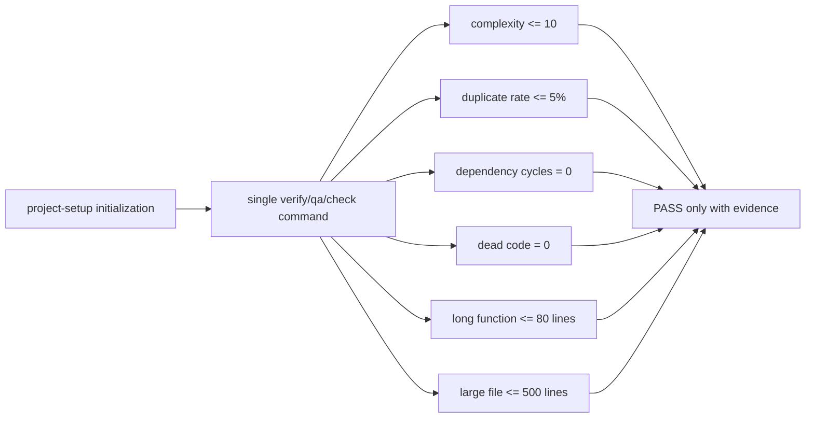

# Project Setup Hard Static-Quality Gates Implementation Plan

## Status

- [x] Inspect the current project-setup test and quality-gate contracts.
- [x] Persist the approved Spec and implementation plan.
- [x] Add RED contract tests for mandatory metric gates and evidence semantics.
- [x] Update verification, production-baseline, and project-setup entrypoint guidance.
- [x] Synchronize repository architecture documentation and ADR.
- [x] Run package/repository tests, validator, link/diff checks, and boundary scans.
- [x] Complete independent review and risk-adapted QA.

## Design



The five requested source-quality categories are mandatory for projects with executable code. Defaults are portable starting thresholds; projects may be stricter. Tool choice remains stack-specific, but every gate needs a discoverable command, committed configuration or documented threshold, and an aggregate result.

## Implementation Steps

1. Add contract tests that require hard-gate wording, all five metric names, default thresholds, aggregate execution, and `[FAIL]`/`[BLOCKED]`/`[N/A]` semantics.
2. Run the package tests and retain RED evidence.
3. Update `project-setup/references/verification.md` with the mandatory gate table and evidence rules.
4. Update `project-setup/references/production-baseline.md` and `project-setup/SKILL.md` so initialization configures and runs the gates.
5. Add the repository ADR and update module/architecture documentation.
6. Run package and repository suites, the bundled validator, local Markdown-link validation, diff checks, and the boundary scan.
7. Obtain an independent Spec Verifier + Cleaner review, repair valid findings, rerun affected checks, and record final QA.

## Files

- `project-setup/SKILL.md`
- `project-setup/references/verification.md`
- `project-setup/references/production-baseline.md`
- `project-setup/tests/test_skill_contract.py`
- `docs/architecture.md`
- `docs/architecture/modules.md`
- `docs/architecture/modules/project-setup.md`
- `docs/decisions/0003-project-setup-hard-quality-gates.md`
- `docs/specs/2026-09-01-project-setup-hard-quality-gates.md`
- `docs/plans/2026-09-01-project-setup-hard-quality-gates.md`

## Data, Configuration, and Interface Changes

- Initialized projects must expose one aggregate quality command that invokes all five source-quality gates.
- Initialized projects must record threshold definitions, analyzer scope, exclusions, command, and tool/version in canonical project configuration or `docs/quality-gates.md`.
- No fixed analyzer, runtime API, service, or global tool installation is added.

## Test Strategy

```text
python3 -m unittest discover -s project-setup/tests -p 'test_*.py' -v
python3 -m unittest discover -s tests -p 'test_*.py' -v
uv run --with pyyaml python <skill-creator>/scripts/quick_validate.py project-setup
git diff --check
```

Also validate local Markdown links, placeholder absence, no workflow-skill dependency, no silent tool installation, and no unrelated skill changes.

## Documentation Impact

Docs Impact: Updated.

- Quality-gate semantics in `project-setup` references and entrypoint are changed from risk-based evaluation to mandatory executable gates.
- Repository module and architecture documentation, ADR, Spec, and Plan record the new invariant.

## Verification Evidence

- `[PASS]` package contract suite: `python3 -m unittest discover -s project-setup/tests -p 'test_*.py' -v` — 13 tests.
- `[PASS]` repository suite: `python3 -m unittest discover -s tests -p 'test_*.py' -v` — 3 tests.
- `[PASS]` RED evidence: the new hard-gate contract test failed before implementation because `重复代码率` was absent from the former optional metric list.
- `[PASS]` bundled `quick_validate.py project-setup` — skill structure and frontmatter valid.
- `[PASS]` repository-local Markdown link scan — 0 unresolved links.
- `[PASS]` `git diff --check` and trailing-whitespace scan — clean.
- `[PASS]` boundary scan — no optional-only wording for the five requested metric categories, silent analyzer installation, workflow-skill dependency, or unfinished placeholders.
- `[PASS]` independent Spec Verifier + Cleaner review — confirmed executable hard-gate semantics, zero Dead Code threshold, migration-baseline `[FAIL]`, aggregate execution, and consistent `[N/A]` behavior.
