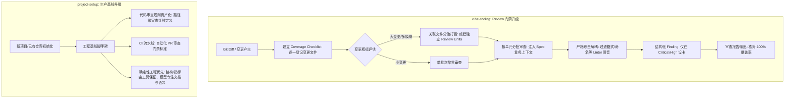

# Plan: 确定性审查门禁与工程生产基线升级

## 任务背景与目标

汲取工业级代码审查实践的核心精髓（确定性工程约束、分治打包、防漏审机制与高信噪比过滤），在不引入或依赖任何额外外部工具的前提下，对仓库进行升级：
1. 强化 `vibe-coding` Review 门禁：引入确定性覆盖率清单（Coverage Checklist 100% 追踪）、关联文件分治打包（Divide-and-Conquer）、明确 Linter 与 Reviewer 职责边界、结构化 Finding 评级与降噪过滤。
2. 升级 `project-setup` 生产基线：在工程基线中增加代码审查规则治理（Code Review Governance），确立审查规则资产化与 CI 审查门禁，强化确定性工具优先的设计原则。

## 架构影响评估

Architecture Impact: None
本变更仅涉及技能规程（Skill instructions）与契约测试的演进，不改变系统运行时架构拓扑或服务组件。

## 方案流程图

## 实施步骤

1. **测试驱动 (RED)**：
   - 在 `tests/test_vibe_coding_contract.py` 中增加断言：验证 Coverage Checklist 契约、分治打包（Divide-and-Conquer）机制、Linter 边界隔离与降噪要求。
   - 在 `project-setup/tests/test_skill_contract.py` 中增加断言：验证审查规则资产化治理、确定性工具解耦原则及 CI 审查门禁。
   - 运行测试，确认因文档尚未更新而失败。
2. **规程实现 (GREEN)**：
   - 编辑 `vibe-coding/references/review.md`：增加 Coverage Checklist、分治打包原则、Linter/Reviewer 职责解耦、结构化 Finding 分级与降噪规范。
   - 编辑 `vibe-coding/SKILL.md`：同步第 6 节 Review 门禁更新。
   - 编辑 `project-setup/references/production-baseline.md`：增加关于代码审查规则治理（路径级红线资产化、CI 审查门禁、确定性工具优先解耦）的基线要求。
   - 编辑 `project-setup/SKILL.md`：在蓝图与验证章节同步代码审查规则资产与确定性工具解耦的要求。
   - 运行测试，确认全部通过。
3. **优化重构 (REFACTOR)**：
   - 检查用词与排版，确保 Markdown 格式规范，文字清晰严谨，无外部专有工具残留。
4. **架构与文档同步 (LINT:ARCH)**：
   - 检查文档影响与链接完整性。
5. **完整回归验证 (QA)**：
   - 运行全量单元测试套件：`python3 -m unittest discover tests` 和 `python3 -m unittest discover project-setup/tests`。
